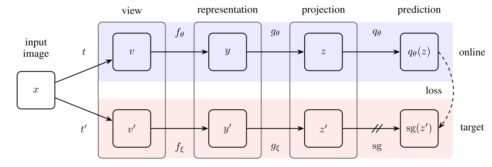
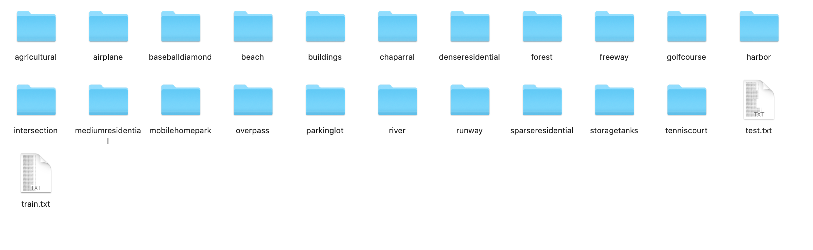
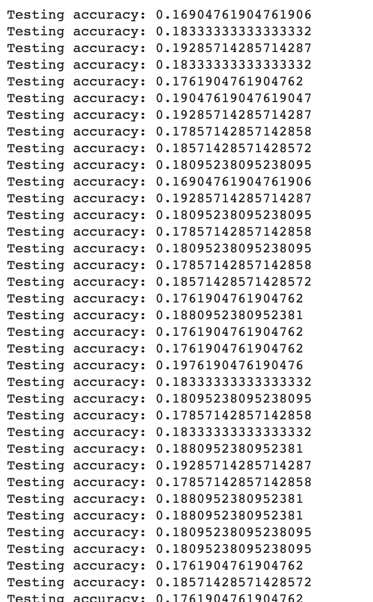

# UCMerced-BYOL
### Using BYOL method to classify UCMerced dataset


## Installation

Clone the repository and run
```
$ conda env create --name byol --file env.yml
$ conda activate byol
$ python main.py
```

## dataset

(http://weegee.vision.ucmerced.edu/datasets/landuse.html)

## Train preparation


## Result
The Logistic Regression evaluation file is in eval/



## Feature Evaluation

We measure the quality of the learned representations by linear separability.

During training, BYOL learns features using the STL10 ```train+unsupervised``` set and evaluates in the held-out ```test``` set.

|       Linear Classifier      | Feature  Extractor | Architecture | Feature dim | Projection Head  dim | Epochs | Batch  Size | STL10 Top 1 |
|:----------------------------:|:------------------:|:------------:|:-----------:|:--------------------:|:------:|:-----------:|:-----------:|

| Logistic Regression  (Adam) |     BYOL (SGD)     |   [ResNet-18](https://drive.google.com/file/d/1Qj01H8cox8067cpCwhHZSQ0nfQl2RHbQ/view?usp=sharing)  |     512     |          128         |   20   | 16          |    19.7%    |

